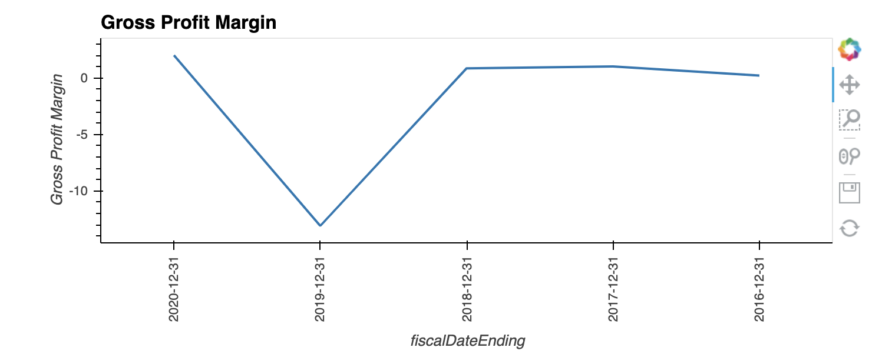
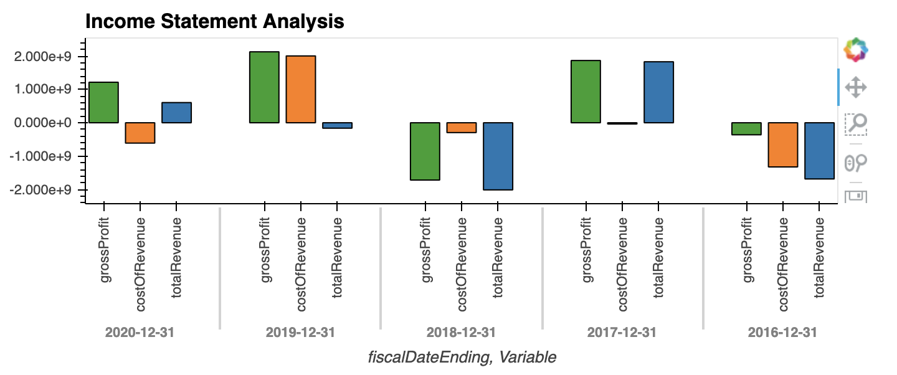
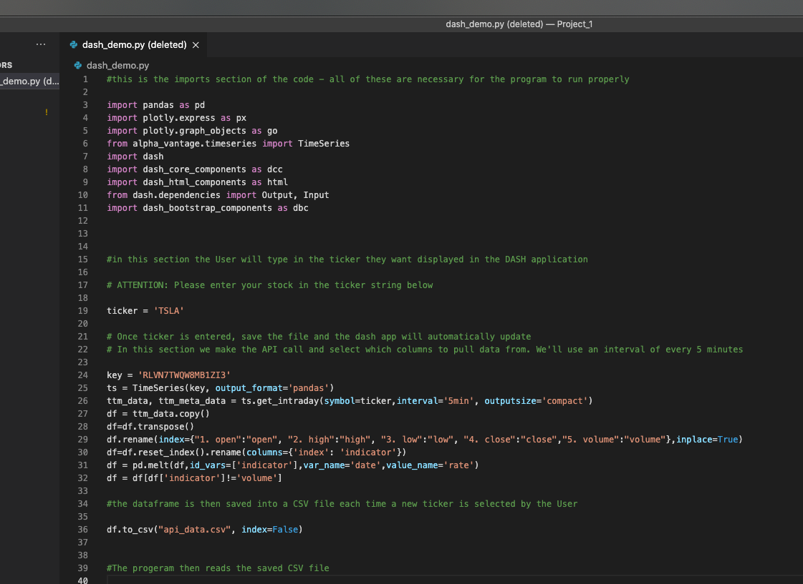

# Fintech Project 1 - Retail Investors: Leveling Up

The ease of access to company information for the average retail investor is relatively limited. They might hear about a stock in the news or see trading charts that reflect price, but that information isn't usually available in the same place as long-term data/information about company. Our goal with this project is to bridge that gap. Our aim is to provide the average retail investor with long term data along with intraday charts in the same place, so they can make educated purchasing decisions on stocks.

Our goal was to create a dashboard where investors can see detailed company information all in one place. 

### This project is broken into two independent parts
Due to time constraints, the code in each part functions independently of each other at this point. Long term, our goal is to bring part one and part two together, where users will be able to see a single dashboard with both long term and short term historical data in one place.

#### Part 1 Long term hitorical data: 
This part of the project pulls historical financial statements directly from the Alpha Vantage API. The collect_data.ipynb is responsible for calling the API and extracting the data. The four functions at the beginning individually extract one financial statement. The get_financials function at the bottom allows the user to input any list of tickers to extract financial statement data in a JSON format. Once the JSON files are created the import_data.ipynb program is used to read in the JSON data and allows the user to extract any financial statement individually using the get_financials function. Now the user is free to create a dataframe with this data and engage in analysis and visualization.

#### Part 2 - Intraday Data Displayed:
Part 2 of this project pulls in most recent intraday data in from the Alpha Vantage API for whichever stock the User selects. Once the User saves and runs the code, the intraday movement of the stock is displayed in a DASH app. It displays 3 things: (1) the ticker that the User selected, (2) an indicator graph that displays the percent change in the stock over that day, and (3) a line graph that shows how the stock's price changed throughout the day. If the stock price finished higher at the end of the day, the indicator and line graph will be green, if not, they will be displayed in red. Furthermore, since the graphs are built using Plotly, the User can zoom into certain areas of the graph to get a closer look.

---

## Technologies

Part 1:

[json](json) - to interact with JSON files in Python

[pandas](pandas) - Python package that provides fast, flexible, and expressive data structures designed to make working with "relational" or "labeled" data both   easy and intuitive

[path](path) - to find files and read them into the program

[NumPy](NumPy) - NumPy is a Python library used for working with arrays

[hvplot](hvplot) - to visualize data in interactive graphs.


Part 2:


```python
import pandas as pd
import plotly.express as px
import plotly.graph_objects as go
from alpha_vantage.timeseries import TimeSeries 
import dash                               
import dash_core_components as dcc
import dash_html_components as html
from dash.dependencies import Output, Input
import dash_bootstrap_components as dbc  
```

---

## Installation Guide

Install the following in your conda dev environment

Part 1:

```python
pip install path
pip install pandas
pip install json
pip install numpy
pip install hvplot
```
Part 2: 

```python
pip install dash
pip install dash-bootstrap-components
pip install alpha-vantage
```

---

## Usage

### Part 1 
-Open collect_data.ipynb first to collect the data from the api
-Input the desired stock tickers in brackets within the get_financials function
-After this code is ran a series of JSON files will be created on the users computer

-Open import_data.ipynb to read the JSON files and manipulate the data
-To return the desired financials input the stock ticker and statement you wish to pull as follows:  ret = get_financials([ticker], statement)
-The desired data will now to returned to whatever variable the user equated it to and is ready to be turned into a data frame

-Create a dataframe using Pandas to allow for data manipulation, analysis and visualization. 






### Part 2

-Make all the necessary installations and imports, then type in the ticker name you would like to see data for.

-Once ticker is entered, save the file and the dash app will automatically update
-In this section we make the API call and select which columns to pull data from. We'll use an interval of every 5 minutes

-the dataframe is then saved into a CSV file each time a new ticker is selected by the User
-The progeram then reads the saved CSV file

-Next, we have the main setup for the DASH app, and the next section sets up the layout for the DASH app

-Next we setup the DASH app callback for the Indicator Graph. The indicator graph shows the percent change for the stock over the course of the day
-It will either display numbers in green if there was a positive change, or red if there was a negative change in the stocks value over the course of the day

-Next we setup the DASH app callback for the Line Graph. Similarly, it will display a green line with green filling underneath if there was a positive change, or it wil display a red line with red filling underneath if there was a negative change over the course of the day

-The final function that makes the DASH app run
-After the program runs, navigate to this link (http://127.0.0.1:3000/) to run the program. This link will also display in your terminal below




---

## Examples

make sure you activate your conda dev environment (python 3.8) before running the code, then intall all the required libraries so that the DASH app will work:
```
conda activate dev
```
After the dev environment is active, make your imports and follow the comment instructions in the code. Put your desired ticker in, run the code, and then navigate to the recomended Flask server to see the DASH app (http://127.0.0.1:3000/)

---

## Contributors

UCB Fintech Bootcamp, Gabriel Silva & Wynham Guillemot 

---

## License

MIT License

Copyright (c) [2021] [UCB Fintech Bootcamp, Gabriel Silva & Wynham Guillemot]

Permission is hereby granted, free of charge, to any person obtaining a copy
of this software and associated documentation files (the "Software"), to deal
in the Software without restriction, including without limitation the rights
to use, copy, modify, merge, publish, distribute, sublicense, and/or sell
copies of the Software, and to permit persons to whom the Software is
furnished to do so, subject to the following conditions:

The above copyright notice and this permission notice shall be included in all
copies or substantial portions of the Software.

THE SOFTWARE IS PROVIDED "AS IS", WITHOUT WARRANTY OF ANY KIND, EXPRESS OR
IMPLIED, INCLUDING BUT NOT LIMITED TO THE WARRANTIES OF MERCHANTABILITY,
FITNESS FOR A PARTICULAR PURPOSE AND NONINFRINGEMENT. IN NO EVENT SHALL THE
AUTHORS OR COPYRIGHT HOLDERS BE LIABLE FOR ANY CLAIM, DAMAGES OR OTHER
LIABILITY, WHETHER IN AN ACTION OF CONTRACT, TORT OR OTHERWISE, ARISING FROM,
OUT OF OR IN CONNECTION WITH THE SOFTWARE OR THE USE OR OTHER DEALINGS IN THE
SOFTWARE.
